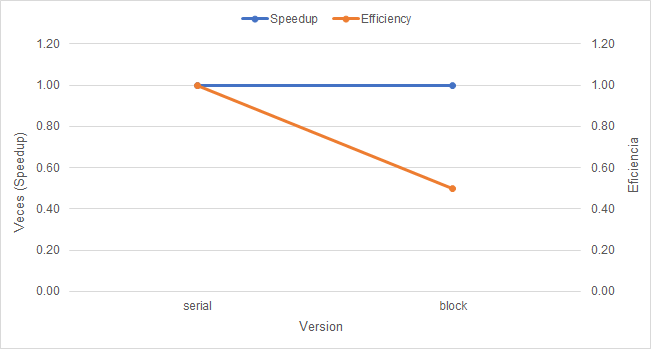

### Proyecto 2.1 Análisis de rendimiento

En esta etapa del proyecto en primera instancia se creó toda la lectura de archivos, simulación de calor y escritura de forma serial.

Luego, para definir cuál parte del código era mejor de implementar concurrentemente, se utilizó la herramienta kcachegrind. Esta herramienta se utilizó para determinar cuáles eran subrutinas del código son las que tomaban más tiempo en finalizar, para así hacerlas paralelas.

Los resultados fueron los siguientes:

Como se logra observar, las subrutinas las cuales consumen más tiempo corresponden a la simulación de calor. Por lo tanto, esas subrutinas se harán de forma concurrente.

Posterior a realizar la implementacion de la concurrencia, se obtuvo la siguiente grafica:

Se puede identificar que por la linea de speedup, el tiempo de duracion del serial y el concurrente con mapeo por bloque fue igual, puesto que la linea no vario, es completamente horizontal. Por otra parte se puede identificar que la eficiencia si bajo a la mitad, esto porque se utilizaron mas recursos de computadora, y el aumento de rendimiento fue nulo, por lo tanto se desperdiciaron tales recursos. Se realizo la comparacion sobre la version concurrente con mapeo por bloque, debido a que este tipo de mapeo fue el que obtuvo el menor tiempo de entre todos los otros mapeos. Al utilizar una computadora de unicamente 2 nucleos se establece la hipotesis de que esta limitacion fisica afecto la concurrencia del programa.
