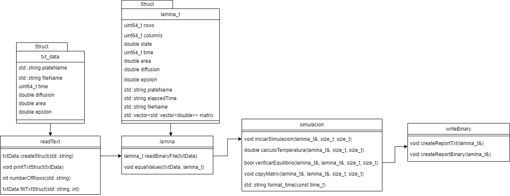

## Diseño de la primer parte del proyecto 2.1

En la siguiente se representa el diagrama de clases implementado en el proyecto:

Se puede identificar un flujo, primeramente se crea una clase readText, ademas un struct de tipo txt_data donde se guardan valores importantes leidos en los archivos jobs que contienen plates. Seguidamente se crea una clase lamina, donde se leen datos binarios de un archivo, y ademas se crea un struct lamina_t que guarda una matriz con los valores leidos en el archivo binario. Ya teniendo un struct lamina_t con informacion obtenida del archivo binario y de readText, se envia a ejecutar a otra clase llamada simulacion, donde se realiza la simulacion de una transferencia de calor sobre una lamina de cierto material. Finalmente cuando se ha llegado al estado deseado, en otra clase llamada writeBinary, se escribe un reporte binario y uno de tipo texto con los resultados obtenidos en la simulacion.