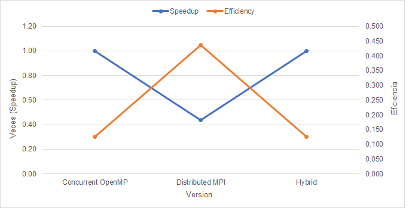

### Proyecto 2.2 Análisis de rendimiento

En esta etapa del proyecto en primera instancia se creó toda la lectura de archivos, simulación de calor y escritura de forma serial.

Luego, para definir cuál parte del código era mejor de implementar concurrentemente, se utilizó la herramienta kcachegrind. Esta herramienta se utilizó para determinar cuáles eran subrutinas del código son las que tomaban más tiempo en finalizar, para así hacerlas paralelas.

Los resultados fueron los siguientes:

Como se logra observar, las subrutinas las cuales consumen más tiempo corresponden a la simulación de calor. Por lo tanto, esas subrutinas se harán de forma concurrente.

Asi mismo en esta segunda etapa del proyecto no unicamente se paralelizo esa zona critica, sino que se busco crear diferentes procesos los cuales ejecuten el codigo de forma concurrente utilizando MPI. Esto signfica que si una archivo de texto con seis lineas se corre con dos procesos, cada proceso se encargaria de procesar tres lineas del archivo de texto.

Posterior a realizar la implementacion de la concurrencia y distribucion, se obtuvo la siguiente grafica:

Se puede identificar en la ejecucion de las diferentes pruebas, resultados ciertamente variados. Primeramente en la prueba con 1 proceso y 8 hilos se refleja el speedup estandar de 1 y puesto que se utilizan 8 hilos, la eficiencia se cae, sin embargo esto no es un reflejo exacto de su eficiencia puesto para ver esto se tendria que comparar con una solucion de 1 proceso y 1 hilo. Seguidamente en la prueba de MPI Distribuido con 24 procesos y 1 hilo se tiene una disminucion en el speedup, se tiene como hipotesis que al no ser necesario tener 24 procesos para ejecutar el programa, se ralentiza la ejecucion y por ello baja el speedup. A pesar de que baja el speedup, en este caso sube la eficiencia, puesto que si bien el tiempo aumenta un tanto, la utilizacion de recursos es mucho menor, por lo tanto se puede concluir que se estan utilizando dichos recursos de una manera mas estrategica. Finalmente la ultima prueba realizada fue la hibrida, donde se utilizaron 3 procesos y 8 hilos, se identifica un pequeño aumento en el speedup, esto se puede explicar con una menor utilizacion de procesos y mayor cantidad de hilos, aunque el aumento de hilos tampoco se torna muy necesario. Dicho aumento de hilos baja abruptamente el rendimiento, puesto que, a pesar de que el speedup fue positivo con respecto a su prueba antecesora, este no fue lo suficientemente grande como para dar credito a la utilizacion de mas hilos y por ello la eficiencia se cae al desperdiciar recursos de la maquina. 
