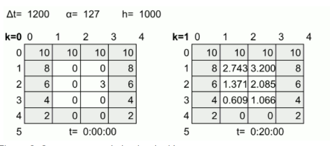

##Nota: tira error de mpi al final del proceso pero si imprime los resultados bien. 
### Problema a resolver 
El presente código busca simular la transferencia de calor entre materiales. La manera realizar esta simulación es a través de una matriz, la cual cada celda representa una celda dentro del material, el cual va a transferir o perder calor. La transferencia funciona de celda a la misma celda, por ejemplo se calcula la perdida o ganancia de la celda 2,2, y su resultado se almacena nuevamente en la celda 2,2. Los datos que utilizan dentro de esta transferencia corresponde a cuanto dura cada transferencia (pueden existir múltiples), el grado de difusión del material, el área de cada celda del material y el épsilon. Estos datos son importantes, ya que para calcular la perdida o ganancia de calor de cada celda se debe dictar a través de una fórmula la cual incluye todas estas variables.

A continuación un ejemplo de una transferencia de calor:

Imagen 1.1 obtenida de http://jeisson.work/concurrente/2021b/proyectos/heat/

Tomemos por ejemplo la celda (1,2) la cual tiene un valor de 0 y luego 2.734. Este nuevo valor fue calculado utilizando la formula tiempo*difusión sobre área + la suma de calor de las celdas a su derecha, izquierda, arriba y abajo - 4 por el calor de la celda sobre el área más el calor actual. Por lo tanto, este código busca resolver todas estas transferencias de calor hasta que el punto de equilibrio haya sido alcanzado. Así mismo, se busca leer las placas desde un archivo binario y escribir su resultado de igual forma en un archivo binario, así como crear un archivo de texto con el resultado de la simulación.

### Manual de usuario

El código para compilar requiere un archivo de texto, el cual contenga los datos necesarios para la simulación y el nombre de un archivo binario, el cual contenga la matriz inicial. En este código todos esos datos se encuentran en la carpeta jobs/ y los resultados y reportes de la compilación serán almacenados en la carpeta output/. Este código únicamente recibe archivos .txt(job001.txt por ejemplo) como primer parámetro y la cantidad de hilos que se utilizaran durante la simulación como segundo parámetro.

Un ejemplo para correr el presente código corresponde a:

donde job0001.txt corresponde al .txt que se encuentra de la carpeta jobs/ que se utilizara durante la simulación y 10 corresponde al número de hilos.

Los resultados serán escritos en la carpeta output/

Este código cuenta con un programa de pruebas para verificar si los resultados obtenidos fueron los deseados, donde el programa de pruebas cuenta con su propio manual de usuario dentro de su carpeta.

Resumen:
1. Hacer make
2. Escribir mpiexec -np #deProcesos bin/Proyecto2.2 job001.txt #deHilos
3. Observar resultados .tsv en la carpeta output 
4. Verificar con el programa de pruebas los resultados binarios

### Construcción

La construccion de este codigo se hizo con la idea se paralelizar las secciones que representan mucho tiempo a nivel de ejecuccion , asi mismo se implmento utilizando la tecnologia MPI.

En primer lugar, se comenzó leyendo el archivo.txt, el cual contenía los datos requeridos para comenzar con la simulación, utilizando las librería fstream. Donde todos estos datos se almacenaron en un struct.

Luego se procedió a leer el archivo binario, el cual contiene cada matriz inicial y se almacenaron los datos para la simulación en un struct de lamina_t (ver lamina.hpp)

Siguiente, se creó una simulación la cual recibiera ese struct de lamina_t como parámetro y almacenara la matriz resultante en ese mismo struct.

Por último, se creó una clase la cual se encargara de crear el reporte utilizando el struct el cual contiene los datos obtenidos.