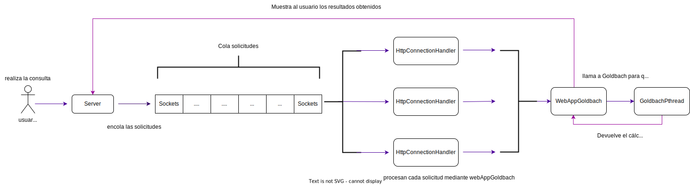

# **Diseño etapa 1: servidor concurrente**

A continuación se muestra un diagrama con la división general del proceso:

## Paso 1:

En el cual inicialmente se recibe una solicitud, parte de una persona usuaria, la cual ingresa mediante el servidor

## Paso 2: 

El servidor recibe y almacena las consultas en una cola de sockets.

## Paso 3:

Cada hilo consume las consultas realizadas, que se encuentras almacenadas en la cola.

## Paso 4: 

Las solicitudes son procesadas por WebAppGoldbach, el cual funciona como "mediador" entre los hilos y la instancia de Goldbach.

## Paso 5: 

Goldbach recibe y procesa cada solicitud, realizando las sumas correspondientes. Cabe destacar, que si se llegó a este paso, fue porque se verificó la validez del dato. 

## Paso 6:

Goldbach devuelve el resultado obtenido a WebAppGoldbach, el cual envia y muestra a la persona usuaria los resultados obtenidos.

# Diagrama con UML

A continuación, se muestra el diagrama con el detalle, de las clases y sus métodos, que fueron modificados o agregados y son necesarios para esta implemetación.

